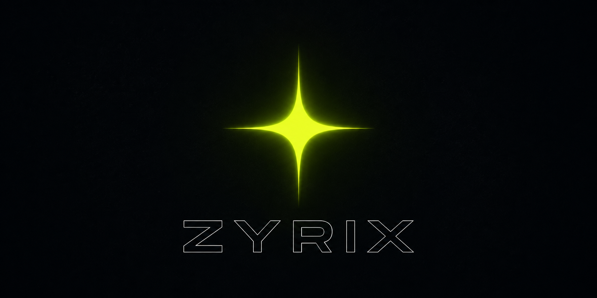

<div align="center">



# ⚡ ZYRIX DEV

**Digital craft studio — work that speaks last, crafted in the dark, built to be seen.**

Discord bots · 3D animated websites · AI tools · SaaS · Automations · Brand systems


</div>

---

## Who we are

**Zyrix** is a one-man digital studio for brands and communities that refuse to blend in.
We ship products and experiences that *work* first — then make them impossible to ignore.

Every build is crafted in the dark, built to be seen: cinematic motion, sharp engineering,
and design that holds up at 60fps.

## What we build

| Service | What you get |
| --- | --- |
| 🤖 **Discord Bots** | Moderation, economy, music, leveling & AI agents that live in your server |
| 🌌 **3D Animated Websites** | WebGL scenes, scroll-driven storytelling, custom shaders & post-processing |
| 🧠 **AI Tools** | LLM integrations, agents, chatbots & copilots with RAG pipelines |
| 📦 **SaaS Products** | Full-stack platforms: strategy, builds, auth, billing & growth loops |
| ⚙️ **AI Automations** | Workflows, agents & pipelines that run the busywork for you |
| 🏷️ **Brand & Business Systems** | Identity, design tokens, strategy & launch systems |

## Tech we craft with

`Next.js` · `TypeScript` · `Three.js` · `React Three Fiber` · `GSAP` · `WebGL` · `Tailwind` · `Node.js` · `Python` · `OpenAI` & `LLM APIs`

## The site

This repository is the home page of Zyrix Dev — a single-page, fully static experience:

```
zyrix-banner.png    Repository banner
```

## Get in touch

- **Email** — [imzyrixx@gmail.com](mailto:imzyrixx@gmail.com)
- **Discord** — `imzyrixx`
- **Instagram** — [@imzyrix](https://instagram.com/imzyrix)
- **GitHub** — [imzyrix](https://github.com/imzyrix)
- **YouTube** — [@imzyrix](https://youtube.com/@imzyrix)

<div align="center">

*Digital after dark — © 2026 Zyrix Dev. All rights reserved.*

</div>
