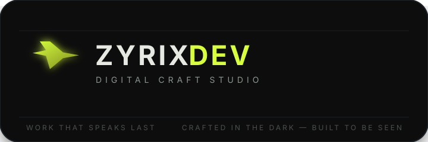
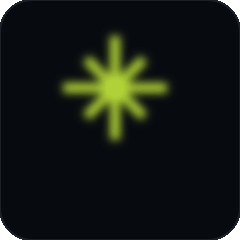
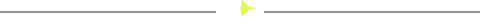
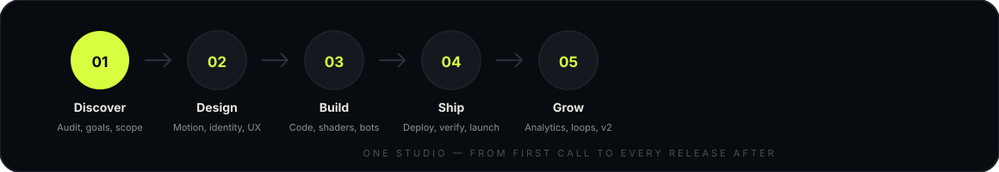
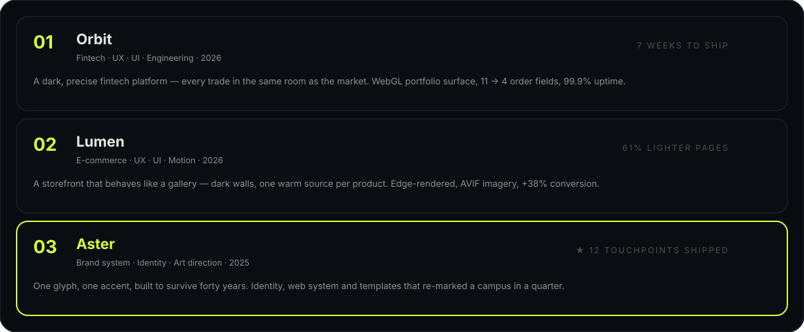
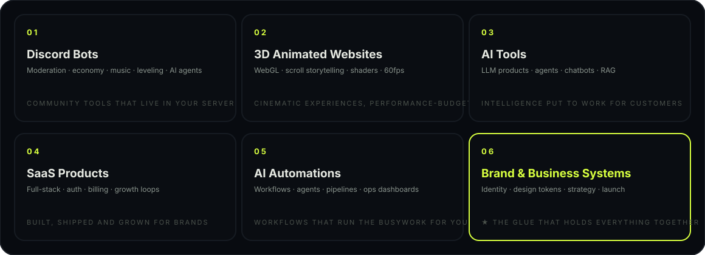
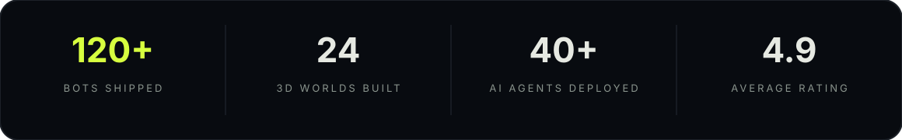
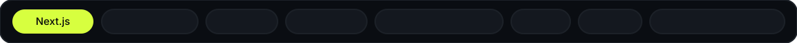

<div align="center">


<br/>



<br/>



# ⚡ ZYRIX DEV

**Digital craft studio — work that speaks last, crafted in the dark, built to be seen.**

Discord bots · 3D animated websites · AI tools · SaaS · Automations · Brand systems

</div>



<div align="center">


</div>


## Table of contents

- [Who we are](#-who-we-are)
- [The philosophy](#-the-philosophy)
- [How we work](#-how-we-work)
- [Featured work](#-featured-work)
- [What we build](#-what-we-build)
- [By the numbers](#-by-the-numbers)
- [Why Zyrix](#-why-zyrix)
- [Tech we craft with](#-tech-we-craft-with)
- [Design system](#-design-system)
- [The site](#-the-site)
- [Project structure](#-project-structure)
- [Run it locally](#-run-it-locally)
- [Deployment](#-deployment)
- [Roadmap](#-roadmap)
- [Contributing](#-contributing)
- [FAQ](#-faq)
- [Get in touch](#-get-in-touch)
- [Support the studio](#-support-the-studio)
- [License](#-license)


## ✨ Who we are

**Zyrix** is a one-man digital studio for brands and communities that refuse to blend in.
We ship products and experiences that *work* first — then make them impossible to ignore.

Everything that leaves the studio is:

- **Crafted in the dark** — the default state is black. Light is a spotlight, not a background.
- **Built to be seen** — cinematic motion, sharp engineering, design that holds up at 60fps.
- **Engineered, not decorated** — every flourish earns its place in the performance budget.
- **Shipped, not handed over** — we build, deploy, and stay on the line until it runs.

The studio runs on one principle: *the work speaks last.* No noise, no filler — the product
carries the conversation. That's why Zyrix ships bots, platforms, and websites that look like
they cost ten times more than they did.

### What that means for you

- **One person, zero handoffs** — no account managers, no lost context. You talk to the person writing the code.
- **Ships fast, ships right** — small focused builds over endless scoping calls.
- **You own everything** — repos, domains, deployments. We hand over keys, not lock-ins.
- **Post-launch care** — we stay on the line for fixes, growth loops, and v2.


## 🧭 The philosophy

1. **Dark first.** `#05070a` ink, bone type, one lime accent. If it doesn't work in the dark, it doesn't ship.
2. **Motion with meaning.** Animation is never decorative — it explains state, directs attention, and rewards patience.
3. **One craft per build.** One glyph, one accent, one metaphor. Constraints are the brand.
4. **Performance is a feature.** Shaders, not image soup. 60fps or it goes back to the drawing board.
5. **Lasting systems.** Identity and code built to survive years — not launch-week hype.

Every decision — color, copy, component, deployment — is tested against these five lines.
If it violates one of them, it doesn't ship. This is how a one-person studio keeps a
ten-person standard.


## 🔄 How we work



**Discover** — audit, goals, scope. We learn your market before we touch a design tool.

**Design** — motion, identity, UX. Wireframes, tokens, and a direction you can feel.

**Build** — code, shaders, bots. Weekly builds you can see, not slides you can't.

**Ship** — deploy, verify, launch. DNS, CI, monitoring — all handled.

**Grow** — analytics, loops, v2. The launch is the starting line, not the finish.

Typical timeline: **week 1** discovery + design direction, **weeks 2–4** build,
**week 5** launch. Larger products get a roadmap instead of a deadline.


## 🚀 Featured work



### 01 — Orbit · Fintech
**UX · UI · Engineering · 2026**

> A dark, precise fintech platform where every trade feels like it happens in the same room as the market.

The system is built on a single luminous object: the ring. Every portfolio state renders as a
position on the orbit — balance at the core, allocations as satellites, movement as light trails.
Engineered as a server-rendered Next.js app with a WebGL portfolio surface, shipped in seven weeks.

| | |
| --- | --- |
| 🕐 | 7 weeks to ship |
| 🔢 | Order ticket: 11 fields → 4 |
| ⬆️ | 99.9% uptime since launch |

### 02 — Lumen · E-commerce
**UX · UI · Motion · 2026**

> A brand storefront for a lighting house — warm, editorial, and fast enough to feel like a showroom.

The catalog was rebuilt as a scrolling editorial: product pages read like features, the cart is a
sidebar that never interrupts browsing, and motion follows the light — reveals feel like lamps
turning on. Served via Next.js edge rendering with AVIF imagery at three breakpoints.

| | |
| --- | --- |
| 📈 | +38% conversion rate |
| 🪶 | 61% lighter pages |
| ⚡ | 1.2s median LCP |

### 03 — Aster · Brand system
**Identity · Art direction · 2025**

> A complete identity for a research lab — one glyph, one accent, and a typographic system built to survive forty years.

One monolith letterform (the *a*), one accent color, a strict dark palette, and a rulebook small
enough to memorize. Delivered as identity, a working web system, and templates for slides,
signage, and lab notebooks — re-marking the campus within a quarter.

| | |
| --- | --- |
| ✦ | 1 glyph, not a logo |
| ⏳ | Built to last 40 years |
| 🧩 | 12 touchpoints shipped |

*More work ships monthly — the latest goes live on the [site](https://zyrix.qzz.io) and the [YouTube channel](https://youtube.com/@zyrix-dev).*


## 🛠 What we build



| Service | What you get |
| --- | --- |
| 🤖 **Discord Bots** | Moderation, economy, music, leveling & AI agents that live in your server |
| 🌌 **3D Animated Websites** | WebGL scenes, scroll-driven storytelling, custom shaders & post-processing |
| 🧠 **AI Tools** | LLM integrations, agents, chatbots & copilots with RAG pipelines |
| 📦 **SaaS Products** | Full-stack platforms: strategy, builds, auth, billing & growth loops |
| ⚙️ **AI Automations** | Workflows, agents & pipelines that run the busywork for you |
| 🏷️ **Brand & Business Systems** | Identity, design tokens, strategy & launch systems |

**Every engagement includes:** design review · performance budget · deploy & monitoring setup ·
documentation · post-launch support window.


## 📊 By the numbers




## 💎 Why Zyrix

| | |
| --- | --- |
| ⚡ **Speed** | Small builds ship in weeks, not quarters. No committees, no queues. |
| 🎯 **Focus** | One project at a time. Your launch gets the full studio, not 10% of an agency. |
| 🔒 **Ownership** | Code, repos, and domains live in your accounts. Zero lock-in, zero hostage. |
| 🌙 **Aesthetic** | A signature dark-and-lime visual language that's instantly recognizable. |
| 📉 **Performance** | Every build is measured: LCP, bundle size, frame time. Numbers are shared, not hidden. |
| 🤝 **Direct line** | You talk to the engineer. Responses in hours, not ticket queues. |

> *"The order ticket went from an industry-average 11 fields to four."* — Orbit client notes


## 💻 Tech we craft with



| Area | Tools |
| --- | --- |
| Frontend | Next.js, React, TypeScript, Tailwind, GSAP, Framer Motion |
| 3D & Motion | Three.js, React Three Fiber, WebGL shaders, post-processing |
| Backend | Node.js, Python, PostgreSQL, Redis |
| AI | OpenAI, LLM APIs, RAG pipelines, agents & automations |
| Infra | Vercel, Cloudflare, Docker, CI/CD |

*The stack is a starting point, not a contract — we pick the right tool for the problem, not the résumé.*


## 🎨 Design system

The entire site runs on a small set of hand-picked tokens — no frameworks, no bloat:

| Token | Value | Role |
| --- | --- | --- |
| `--ink` | `#05070a` | Page background — near-black |
| `--bone` | `#e6e9e2` | Primary type — warm off-white |
| `--lime` | `#d7ff3f` | Single accent — the spotlight |
| `--muted` | `#8a948d` | Secondary type |
| `--lime-dim` | `#7d8a1f` | Hover & glow states |
| Type | Space Grotesk + Inter | Display + body |

Micro-interactions include a session-seconds counter (*"NNNN in the dark"*), a loading screen
with a lime-bar intro, a scroll cue, a custom cursor, and a giant outline **ZYRIX** wordmark in
the footer.

## 🌐 The site

This repository is the home page of Zyrix Dev — a single-page, fully static experience:

- **Dark-first design** with a lime spotlight accent
- **Cinematic loading screen** with a lime-bar intro
- **Live session counter** — *"NNNN in the dark"*
- **Animated stats**, scroll-revealed sections, custom cursor
- **Polaroid marquee** and a giant outline **ZYRIX** wordmark in the footer
- **Zero framework CSS** — pure hand-tuned tokens

```
zyrix-banner.png    Repository banner
zyrix-logo.png      Brand logo
brand/              Brand SVGs & animation
```


## 📁 Project structure

```
src/
├── app/                    Next.js App Router
│   ├── page.tsx            Home page (single-page site)
│   ├── layout.tsx          Global layout, loader + nav chrome
│   ├── not-found.tsx       404 page
│   └── globals.css         Design tokens & all styles
├── components/             UI & experience components
│   ├── Hero.tsx            Hero with peek play-card
│   ├── Work.tsx            Featured work grid
│   ├── Services.tsx        Services list
│   ├── Studio.tsx / Vision.tsx / News.tsx / Platform.tsx
│   ├── Stats.tsx           Animated counters
│   ├── Contact.tsx         Contact section
│   ├── Footer.tsx          Footer with polaroid marquee + ZYRIX wordmark
│   ├── Experience.tsx      Loading screen
│   ├── CornerCounter.tsx   Session-seconds counter
│   ├── CueSound.tsx        Cue & sound
│   ├── SiteChrome.tsx      Cursor, scroll cue, chrome
│   └── Shape.tsx           Sparkle ✦ shape
├── data/                   site copy & projects data
└── lib/                    motion + WebGL helpers
public/assets/
├── image/                  Work shots
├── foreground/             SVG scenery layers
└── generated/              Generated artwork
```


## 🏃 Run it locally

```bash
npm install
npm run dev        # development — http://localhost:3000
npm run build      # production build
npm start          # serve production build
```

Requires **Node 18.17+** and npm.

### Scripts

| Script | What it does |
| --- | --- |
| `npm run dev` | Start the development server with hot reload |
| `npm run build` | Create an optimized production build |
| `npm start` | Serve the production build |
| `npm run lint` | Run ESLint over the codebase |


## 🚢 Deployment

The site is fully static and deployable anywhere:

- **Vercel** — `npx vercel --prod` (zero config)
- **Cloudflare Pages** — set `output: "export"` in `next.config.ts`, then `wrangler pages deploy out`
- **Any static host** — copy the `out/` directory after `next build`

### Vercel + custom domain (the recommended path)

```bash
npx vercel login        # authenticate once
npx vercel --prod       # deploy
npx vercel domains add your-domain.com
```

Then point your DNS (CNAME) to `cname.vercel-dns.com` and Vercel provisions HTTPS automatically.


## 🗺 Roadmap

- [x] Single-page studio site (this repo)
- [x] Dark design system + brand assets
- [x] Brand SVGs and animated sparkle
- [ ] Case-study pages for Orbit / Lumen / Aster
- [ ] Open-source Discord bot template library
- [ ] WebGL shader gallery
- [ ] Zyrix Dev YouTube launch series
- [ ] Client portal for project status

*Have an idea? Open an issue or say hi — roadmap is driven by real problems, not guesses.*


## 🤝 Contributing

This is the studio's home page, but good ideas are welcome:

1. **Found a bug?** Open an issue with a screenshot and the console output.
2. **Have an idea?** Open a discussion first — we'll shape it together.
3. **Want to build?** Fork, branch (`feat/name`), and open a PR. Keep it dark-first.

Please keep contributions aligned with the five [philosophy](#-the-philosophy) lines —
performance budgets, dark-first tokens, and motion with meaning.


## ❓ FAQ

<details>
<summary><b>Is Zyrix a team or a single person?</b></summary>
<br/>
A single engineer with a studio standard. One line of communication, full ownership of the craft.
</details>

<details>
<summary><b>How fast can you ship?</b></summary>
<br/>
Landing sites: 1–2 weeks. Full products: 4–8 weeks. Bots and automations: days to weeks.
</details>

<details>
<summary><b>Do you work with existing teams?</b></summary>
<br/>
Yes — as an embedded engineer, a design partner, or an audit-and-fix contractor. The work
speaks for itself either way.
</details>

<details>
<summary><b>What does it cost?</b></summary>
<br/>
Fixed scopes, not hourly anxiety. Every project gets a clear price before a single line is
written. Say hi and you'll have a number within 48 hours.
</details>

<details>
<summary><b>Can I see more work?</b></summary>
<br/>
The [site](https://zyrix.qzz.io) shows current work; the [YouTube channel](https://youtube.com/@zyrix-dev)
shows the builds in motion. Private case studies on request.
</details>


## 📬 Get in touch

- **Email** — [imzyrixx@gmail.com](mailto:imzyrixx@gmail.com)
- **Discord** — `imzyrixx`
- **Instagram** — [@imzyrix](https://instagram.com/imzyrix)
- **GitHub** — [imzyrix](https://github.com/imzyrix)
- **YouTube** — [@zyrix-dev](https://youtube.com/@zyrix-dev)

Open for new projects — *available worldwide, remote-first.*

**Response time:** under 24 hours, usually much faster.


## ☕ Support the studio

Loved the work? The best support is:

- **Starring** this repo and the client projects you like
- **Subscribing** to the [YouTube channel](https://youtube.com/@zyrix-dev)
- **Sending referrals** — the studio lives on word of mouth
- **Saying hi** — a message costs nothing and keeps the dark lit


## 📄 License

This project is licensed under the [MIT License](./LICENSE).

<div align="center">


*Digital after dark — © 2026 Zyrix Dev. All rights reserved.*

</div>
